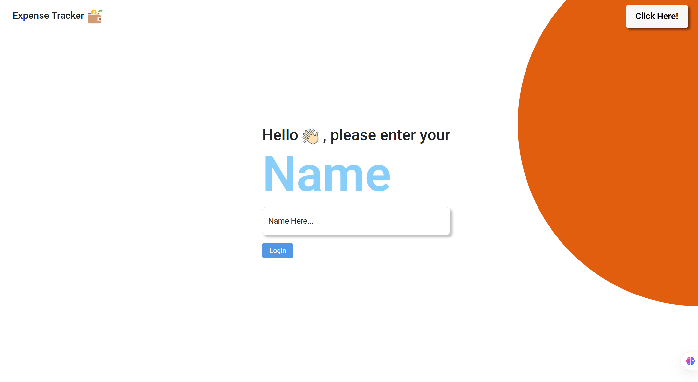
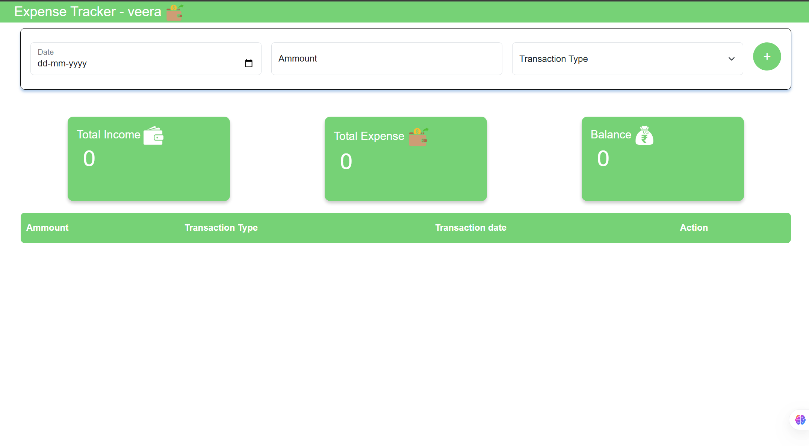
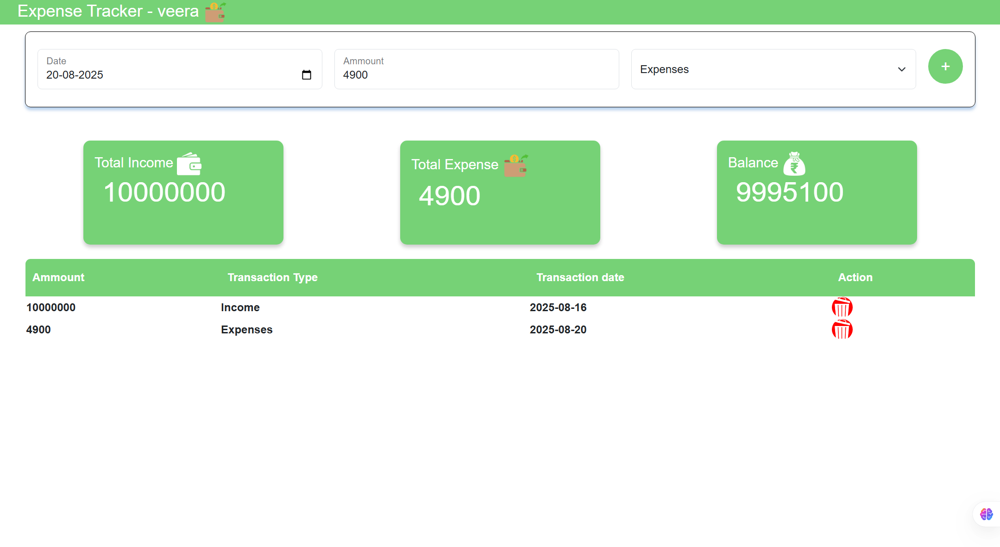
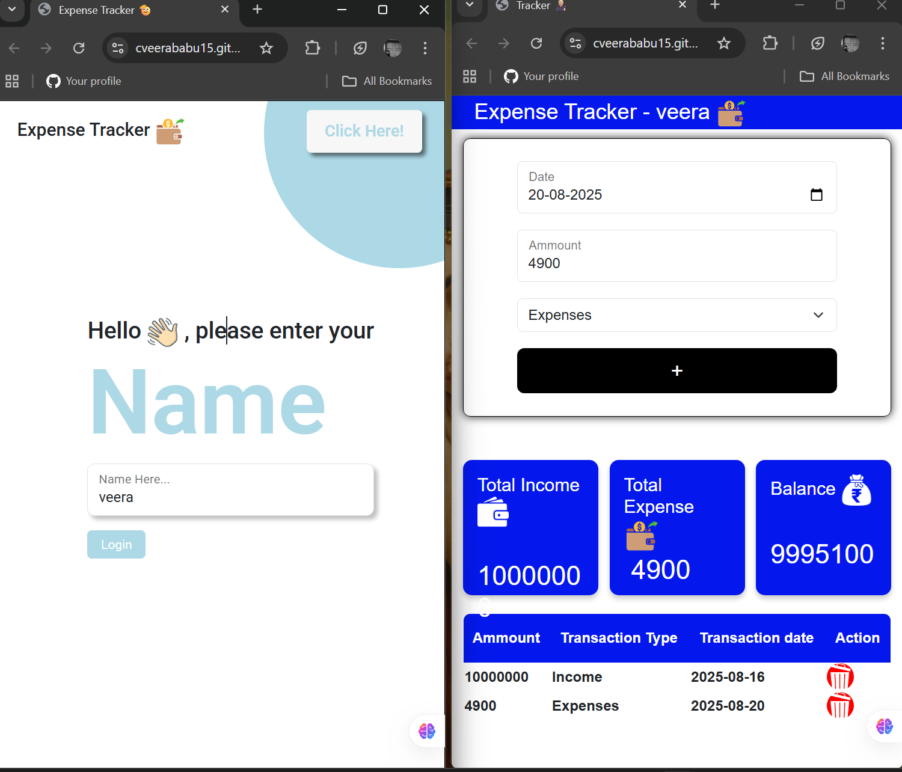

# 💰 Expense Tracker

A simple and intuitive **web-based Expense Tracker application** built with **HTML, CSS, and JavaScript**.  
This tool helps you keep track of your **income**, **expenses**, and **overall balance**, providing a clear and instant overview of your financial transactions.

---

## ✨ Features
- 🖥 **User-Friendly Interface** – Clean and responsive design for easy navigation.
- 📈 **Income & Expense Tracking** – Categorize your transactions as income or expenses.
- ⏱ **Real-time Balance Update** – See your total income, total expenses, and current balance updated instantly.
- 📜 **Transaction History** – Detailed table of all recorded transactions with amount, type, and date.
- 🙋 **Persistent User Name** – Saves your entered name locally for a personalized experience.
- ❌ **Delete Transactions** – Easily remove unwanted transaction entries.

---

## 🚀 Live Demo
[Click here to view the live demo](https://cveerababu15.github.io/Expensive-Tracker/)  


---

## 📸 Screenshots
> Replace the below placeholders with your actual screenshots.

1. **Welcome / Login Page**  
   

2. **Main Tracker Interface**  
   

3. **Adding a Transaction**  
   

4. **Responsive Design (Mobile View)**  
   

---

## 🛠️ Technologies Used
- **HTML5** – Structure of the application.
- **CSS3** – Styling and responsive design.
- **JavaScript (ES6+)** – Core interactive functionality.
- **Bootstrap 5** – Responsive layout and pre-built UI components.
- **Google Fonts (Roboto)** – Clean and consistent typography.

---

## ⚙️ Installation & Setup
1. **Clone the repository**
   ```bash
   git clone https://github.com/YourUsername/Expense-Tracker.git
